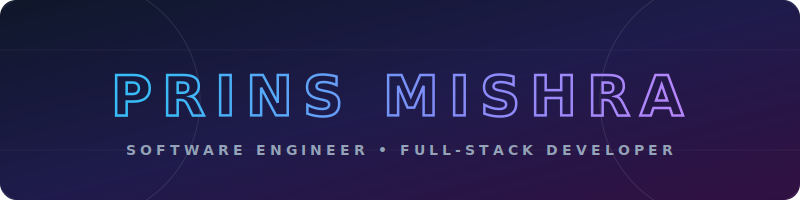

<!-- Beautiful Custom SVG Banner -->

  

<!-- Centered Hello Header with Typing Effect -->

  

  
  
  
  

---

### 🚀 About Me

I am a passionate **Software Engineer** focused on building clean, high-performance web applications, embedded database engines, and end-to-end MLOps solutions. I enjoy translating complex logic into user-friendly digital experiences using **Java**, **React**, and **C/Python**.

- 🎓 Currently pursuing **Master of Technology in Computer Science & Engineering** at **IIIT Bangalore (2025 - Present)**.
- 🌱 Specialized interest areas: **Embedded Database Systems, Scalable Web Architectures, and MLOps/AI Platforms**.
- 💼 Former **Software Engineer** at *Ausumn Team Online Services* and **SDE Intern** at *Techciti Technologies*.
- 💬 Ask me about: **React, Spring Boot, Custom Databases, Machine Learning, and DSA**.
- 📬 Email: **[Prins.Mishra@iiitb.ac.in](mailto:Prins.Mishra@iiitb.ac.in)**

---

## 🛠️ Tech Stack

  

---

## 📌 Featured Projects

### 🗄️ [PrinsDB: Custom Embedded Database Engine](https://github.com/PrinsMishra/KernalDB)
*A modular, C-based embedded database engine designed from the ground up to demonstrate database systems concepts.*
- **Tech Stack:** C, File Systems, Custom Buffer Managers, LRU Cache, B+ Tree Indexing
- **Key Core Components:**
  - **Storage Manager:** Implements slotted-page formatting to read/write database frames onto disk blocks.
  - **Buffer Pool Manager:** Oversees memory pages using an LRU/Clock eviction scheme to maximize buffer efficiency.
  - **Table Heap Layer:** Facilitates record insertions, updates, and sequence scans using table iterators.
  - **Index Manager:** Organizes data pages dynamically with a custom B+ Tree search index.

### 🛡️ [CareerShield: MLOps Layoff Risk Platform](https://github.com/PrinsMishra/layoff-risk-prediction)
*An end-to-end MLOps predictive analytics dashboard mapping industry, workforce size, and AI exposure to corporate layoff risks.*
- **Tech Stack:** TensorFlow, FastAPI, React/Vite, Docker Compose, ELK Stack (Elasticsearch, Logstash, Kibana)
- **Key Core Components:**
  - **ML Model:** Custom neural network built with TensorFlow to evaluate multi-feature risk classifications.
  - **Inference Server:** High-throughput backend built using FastAPI, serving real-time model scoring.
  - **Docker Compose:** Orchestrates containerization of the Vite UI, FastAPI backend, and ELK analytics cluster.
  - **Real-Time Telemetry:** Integrates Logstash pipelines and Kibana dashboards to display user telemetries.

### 🛒 [Click Basket: E-Commerce Food Platform](https://github.com/PrinsMishra/Click-Basket)
*A full-stack, enterprise-style food ordering and delivery web application.*
- **Tech Stack:** React JS, Spring Boot, MongoDB, Java, CSS
- **Key Core Components:**
  - **Backend APIs:** Modular REST endpoints designed using Java Spring Boot with JPA/Hibernate operations.
  - **User Portal:** Responsive frontend interface featuring custom state managers, user authentication, and shopping cart details.
  - **Security:** Built secure JWT authorization filters for admin controls and user accounts.

---

## 📚 Other Core Projects

### 🏫 [ERP Job Offer System](https://github.com/PrinsMishra/ERP-Offer-Add-)
*An ERP portal built to facilitate hiring managers in posting and tracking candidate offers.*
- **Tech Stack:** React, Spring Boot, MySQL, Java

### 📈 [Obesity Risk Prediction](https://github.com/PrinsMishra/ML-Project)
*Data analysis and classifier evaluating lifestyle choices, eating habits, and demographics against obesity levels.*
- **Tech Stack:** Python, Scikit-learn, Pandas, NumPy

### 🏦 [Banking Management System](https://github.com/PrinsMishra/Banking-Management-System)
*A secure command-line banking administrator console utilizing low-level C++ file handling operations.*
- **Tech Stack:** C++, Linux, System Calls, File Handling

---

## 💼 Work Experience

### 💻 Software Engineer
**Ausumn Team Online Services Private Limited** | *June 2023 - Aug 2024*
- Engineered and maintained robust, scalable RESTful APIs using Spring Boot, adhering to security and performance parameters.
- Optimized database persistence and query efficiency by implementing JPA and Hibernate ORM, reducing latency by 15%.
- Refactored core application processes using advanced Data Structures & Algorithms.

### ⚙️ SDE Intern
**Techciti Technologies** | *Jun 2022 - Nov 2022*
- Developed responsive front-end single-page applications using React.js.
- Reduced component development time by 20% by authoring modular, reusable layouts.

---

## 🎓 Education

*   🎓 **M.Tech in Computer Science and Engineering** — *IIIT Bangalore* (2025 - Present)
*   🎓 **B.Tech in Electronics and Communication Engineering** — *BIET Jhansi* (2019 - 2023)

---

## 📊 Developer Stats

### 🏆 LeetCode Stats

  

| Metric | Details |
| :--- | :--- |
| **Global Rank** | 🏅 **56,031** |
| **Total Problems Solved** | 🚀 **837** |
| **Primary Language** | ☕ **Java** (821 problems solved) |
| **Specialized Badges** | 🏅 **365 Days Active** • **100 Days Active (2026)** • **50 Days Active (2026)** |

#### 🧠 Advanced Topics Mastered
- **Dynamic Programming** (160+ problems solved)
- **Backtracking** (37+ problems solved)
- **Monotonic Stack** (31+ problems solved)

---

### 💻 GitHub Stats

  <!-- GitHub Stats Card -->
  
  <!-- Top Languages Card -->
  

  <!-- GitHub Streak Card -->
  

